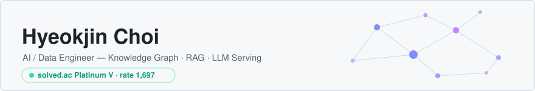

<picture>
  <source media="(prefers-color-scheme: dark)" srcset="assets/banner-dark.svg">
  
</picture>

Agent 시스템, 검색/RAG, 데이터 파이프라인, LLM 서빙을 운영 가능한 시스템으로 만듭니다.
노트로 학습하고, 프로젝트로 검증하고, 글로 정리합니다.

**Portfolio → [0x38a.dev](https://0x38a.dev)**

- AI/Data Engineer (2025.09 – )
- Samsung SW Academy For Youth 13th, Data Track (2025, 1·2학기 프로젝트 우수상 · 수여기관 삼성전자)
- 한동대학교 AI Computer Science & Engineering (GPA 4.01 / 4.5)

## Projects

지식 그래프 · Multi-Agent RAG · 선제적 에이전트 등 실무 프로젝트 케이스 스터디는
**[0x38a.dev/projects](https://0x38a.dev/projects)** 에 정리되어 있습니다.

## Open Source

- **[Orca](https://github.com/stablyai/orca) contributor** — 병렬 에이전트 ADE · ⭐65k · 기여자 360+ ·
  [머지 PR 3건](https://github.com/stablyai/orca/pulls?q=is%3Apr+author%3Achoihjin+is%3Amerged)
- **[VoiceKit](https://huggingface.co/spaces/MCP-1st-Birthday/voicekit)** —
  HuggingFace MCP 1st Birthday 해커톤 · MCP 도구 6종 구현 (❤️53)

## Research & Honors

- 학술논문 2편 — 대한전자공학회 학술대회 (2026) · 한국인공지능 학술대회 (2025)
- 특허 출원 2건 (2025)
- SSAFY 프로젝트 우수상 ×2 (수여기관 삼성전자)
- 대경권 프로그래밍 경진대회 우수상 (2024)
- 빅데이터분석기사 · 정보처리기사 · ADsP · SQLD

## Stack

- **AI / LLM** — Agno · vLLM · SGLang · Neo4j · pgvector
- **Data** — Kafka · Flink · Spark · Airflow · Elasticsearch
- **Backend** — FastAPI · PostgreSQL · Docker · Next.js

## Contact

[0x38a.dev](https://0x38a.dev) · [jjin6573@naver.com](mailto:jjin6573@naver.com) · [solved.ac](https://solved.ac/profile/jjin6573) · [LinkedIn](https://www.linkedin.com/in/%ED%98%81%EC%A7%84-%EC%B5%9C-772649364/)
